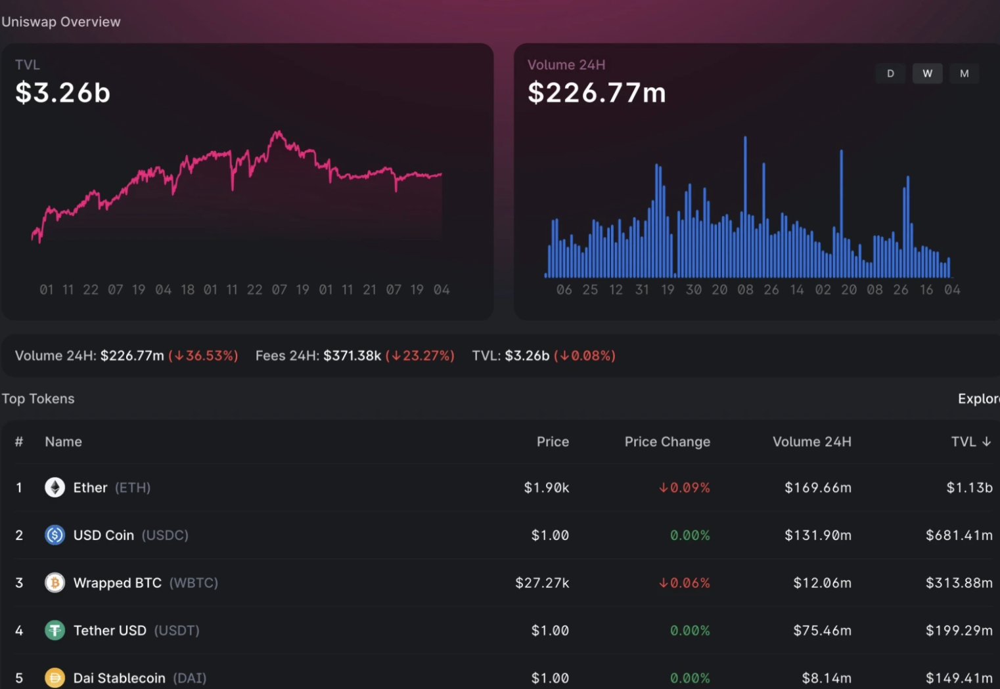
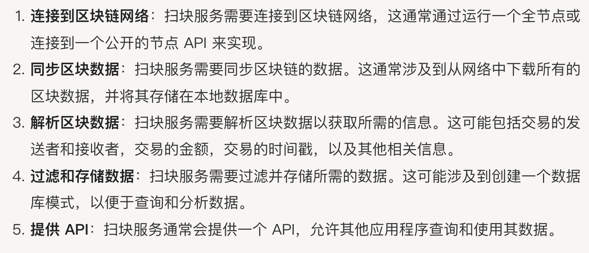
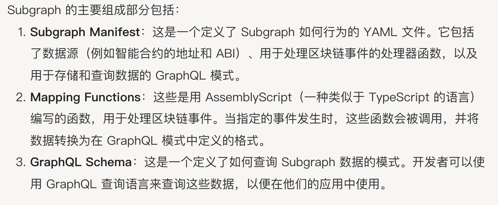

## 数据索引服务

这种面板数据展示是通过扫块服务来实现的。
- 扫块服务（区块链监听器或者爬虫）
  是一种用于监控区块链网络并获取特定信息的服务。
  - 实现步骤
- 通用解决方案
  - Subgraph（子图）
    是一种链上数据索引服务,它使得开发者能够定义如何从区块链中提取，转换和组合数据，然后将这些数据存储在一个高效可查询的格式中。
    - 组成部分
      - Subgraph Manifest
      - Mapping Functions
      - GraphQL Schema
    - 优点
      - 使得开发者更加容易从区块链中获取和使用数据。开发者不需要自己运行节点或依赖不稳定的公共节点，也不需要处理复杂的区块链事件和数据格式。
    - ⚠️注意
      - Subgraph无法单独运行，需要运行在graph node节点之上。graph node是一个标准化的运行环境。
- The Graph
  - 概念
    去中心化数据索引查询协议，subgraph 其实是The Graph协议的一个关键组成部分。
  - 提供的服务
    - 去中心化的The Graph network网络
    - 去中心化Hosted Service  

### Subgraph用法

TheGraph中定义如何为数据建立索引，成为Subgraph，它包含三个组件

1. Manifest 清单(subgraph.yaml) 定义配置项
2. Schema 模式（schema.graphql） 定义数据
3. Mapping映射 （mapping.ts）定义事件到数据的转换
